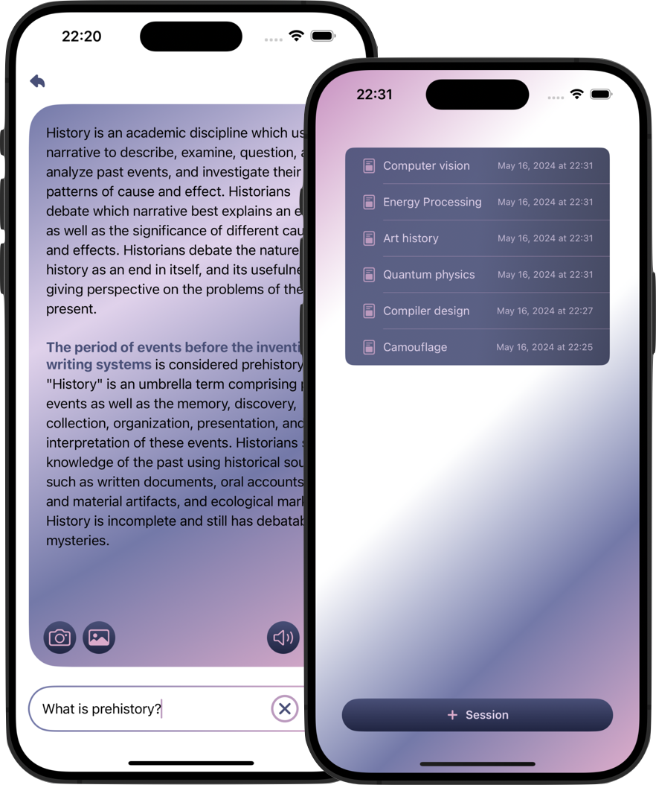
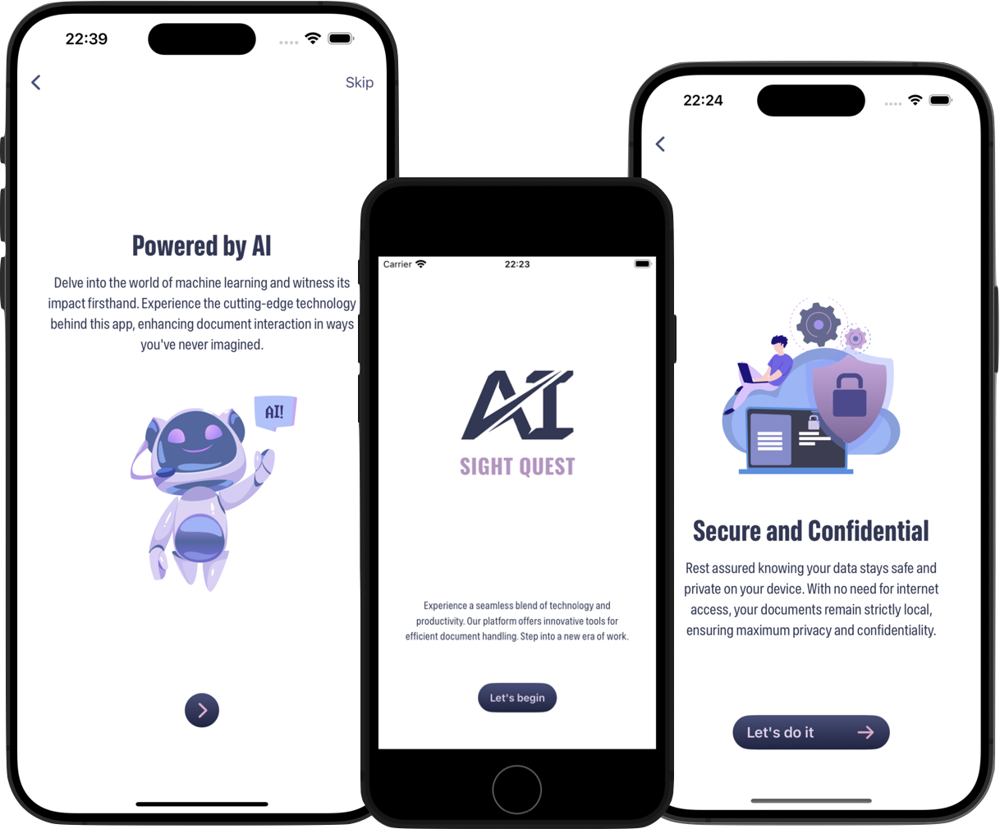
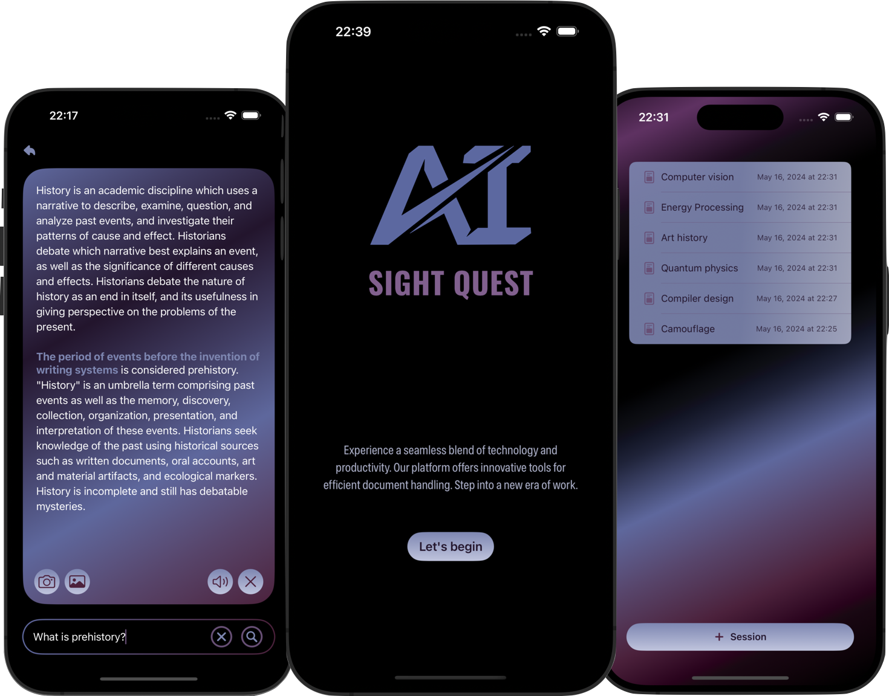

  

  

**AI Sight Quest** is an iOS application powered by Artificial Intelligence that leverages *Machine Learning models* and *Apple's Frameworks*. It enables users to take a photo or select them from their gallery within the app and capture the text using [Apple's Vision Framework](https://developer.apple.com/documentation/vision) and locate relevant passages in a document by asking the **Bidirectional Encoder Representations from Transformers (BERT)** model a question.    

  

## Table of Contents

- [Demo](#demo)
- [Overview](#overview)
- [Installation and Requirements](#installation-and-requirements) <!-- - [References](#references) -->
- [Contribution](#contribution)
- [License](#license)

## Demo

Discover **AI Sight Quest**

## Overview

All computations and processing are performed locally **on the device**, ensuring user *data privacy* and *security*. There's no reliance on external servers or network API calls. Every calculation and processing task is handled by the device itself, enhancing both performance and privacy. 

The app generates answers directly within scanned documents using the Core ML Framework and a question-answering AI model. 

Interacting with this captured text is easy; users can edit or even play it aloud, facilitated by text playback using [Apple's Speech Framework](https://developer.apple.com/documentation/speech).

  

Users can customize their reading experience. They can change the font size or switch between different dark or light color schemes, ensuring optimal readability in various environments.

Also, to achieve our versatile app design, we opted for **vector-based** animations over traditional methods, prioritizing performance. Leveraging **Lottie** animations ensured seamless visuals while maintaining high efficiency.

  

By integrating [Apple's TipKit Framework](https://developer.apple.com/documentation/tipkit) into the application, users benefit from valuable tips and insights, enhancing their experience and effectively guiding them through the app's features.

## Installation and Requirements

To set up and run the application, please follow these steps:

1. Begin by **cloning** the repository onto your local machine.
2. Owing to the substantial size of the BERT model, it is not directly integrated into the project. You may acquire it by **downloading** it from the following link:

 [BERT Model Download Link](https://ml-assets.apple.com/coreml/models/Text/QuestionAnswering/BERT_SQUAD/BERTSQUADFP16.mlmodel)

3. **Rename** the downloaded BERT model to `BERTSQUAD.mlmodel`
4. **Open** the project in Xcode and **integrate** the downloaded model into the project structure at the designated location:

   `./AISightQuest/Resources/BERT Core ML Model Resources`

5. Finally, **build** and **launch** the application either on the iOS simulator or a connected device.

<!-- ## References

 [Project's Figma Design](https://www.figma.com/file/PNYtxvPgMP7x5hdTZz7YIZ/AI-Sight-Quest?type=design&node-id=18%3A479&mode=design&t=LZixx9SKG5oeNCXc-1) -->

## Contribution

Feel free to share your ideas or any other problems. **Pull request**s are welcome! 
For major changes, please open an **issue** first to discuss what you would like to change.

## License

`AI Sight Quest` is released under the MIT license. See [LICENSE](LICENSE) for more information.
