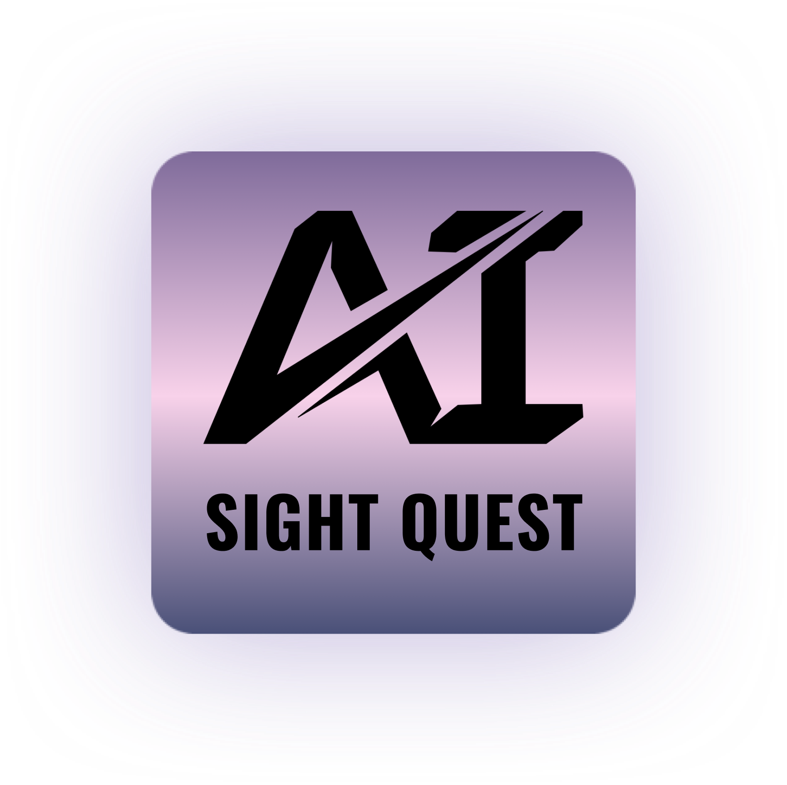

  

**AI Sight Quest** is an iOS application powered by Artificial Intelligence that leverages *Machine Learning models* and *Apple's Frameworks*. It enables users to take a photo and capture the text using [Apple's Vision Framework](https://developer.apple.com/documentation/vision) and locate relevant passages in a document by asking the **Bidirectional Encoder Representations from Transformers (BERT)** model a question.

## Table of Contents

- [Installation and Requirements](#installation-and-requirements)
- [References](#references)
- [Contribution](#contribution)
- [License](#license)

## Installation and Requirements

To set up and run the application, please follow these steps:

1. Begin by cloning the repository onto your local machine.
2. Owing to the substantial size of the BERT model, it is not directly integrated into the project. You may acquire it by downloading it from the following link:

    [BERT Model Download Link](https://ml-assets.apple.com/coreml/models/Text/QuestionAnswering/BERT_SQUAD/BERTSQUADFP16.mlmodel)

3. Open the project in Xcode and integrate the downloaded model into the project structure at the designated location:

   `./AISightQuest/Resources/BERT Core ML Model Resources`

4. Finally, build and launch the application either on the iOS simulator or a connected device.

## References

 [Project's Figma Design](https://www.figma.com/file/PNYtxvPgMP7x5hdTZz7YIZ/AI-Sight-Quest?type=design&node-id=18%3A479&mode=design&t=LZixx9SKG5oeNCXc-1)

## Contribution

Feel free to share your ideas or any other problems. Pull requests are welcome! 
For major changes, please open an issue first to discuss what you would like to change.

## License

`AI Sight Quest` is released under an MIT license. See [LICENSE](LICENSE) for more information.
